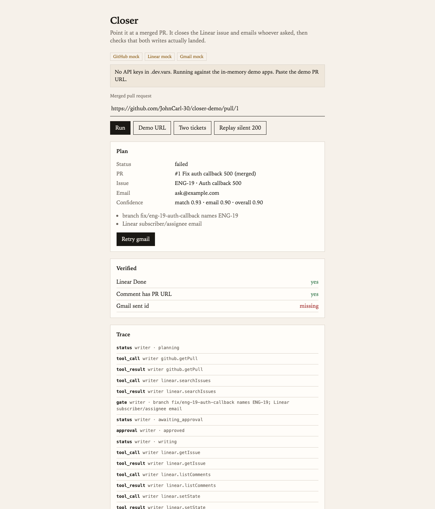
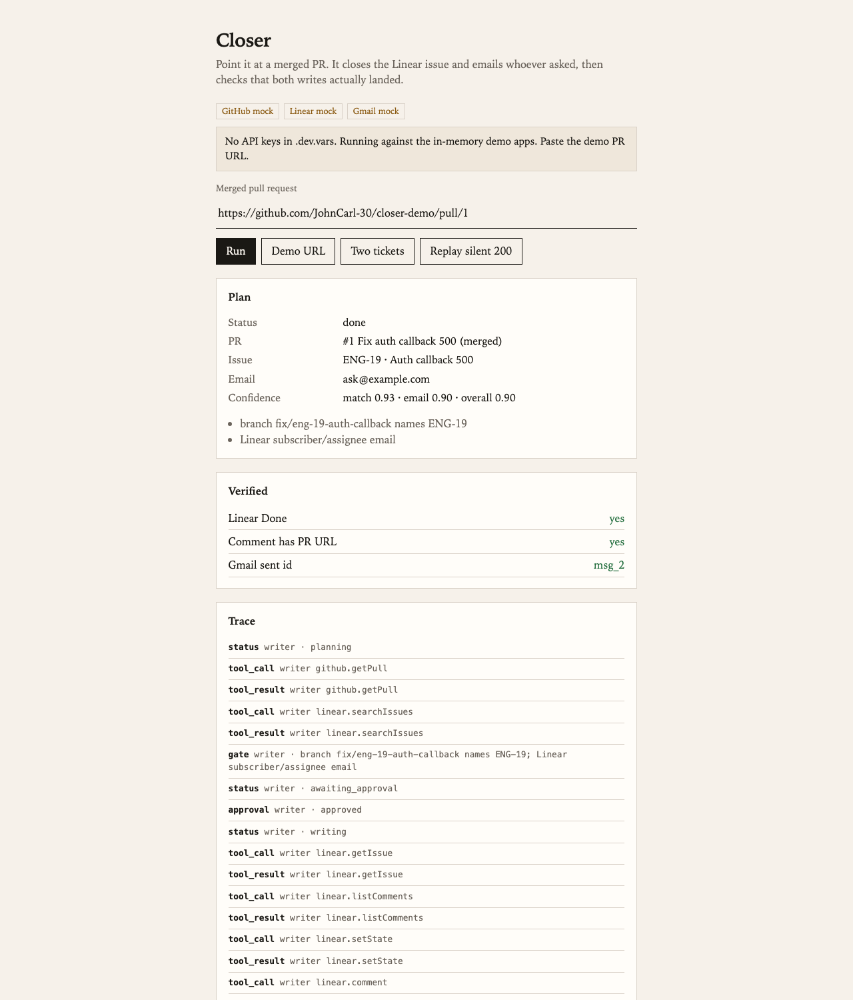
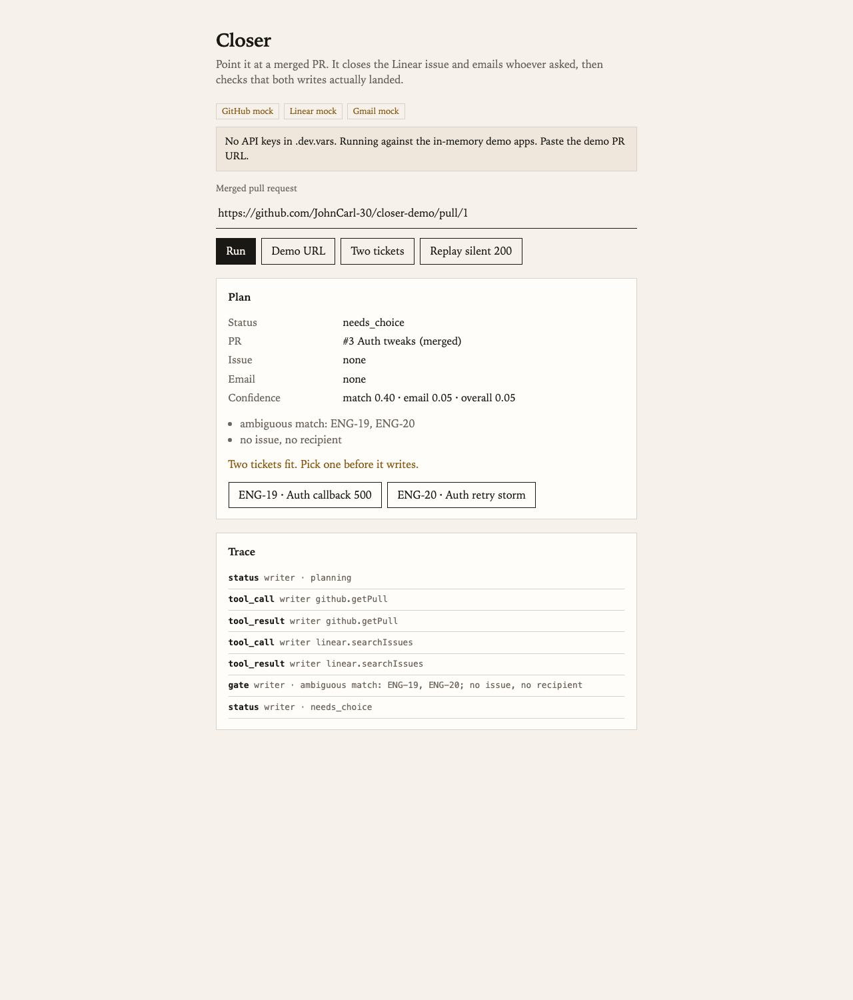

# Closer

[](https://github.com/JohnCarl-30/closer/actions/workflows/check.yml)

A post-ship agent. Paste a merged GitHub PR. It finds the Linear issue, marks it Done with the PR link, emails whoever asked, then reads both apps again. A 200 from Gmail is not enough. The message has to show up in sent mail.

If the PR-to-issue match or the recipient is shaky, it escalates and writes nothing. If two Linear tickets both fit, you pick one before it writes. The silent-200 button is a mock-only replay that proves a Gmail 200 is not enough.



## The 60-second demo

1. **Run** — the demo PR URL is prefilled. The plan card shows the matched ticket, the recipient,
   and the confidence scores with reasons. Nothing has been written yet.
2. **Approve writes** — it marks the ticket Done, comments the PR link, sends the email, then the
   verifier re-reads all three. Green checks are re-reads, not API return codes.
3. **Replay silent 200** — the punchline. Gmail returns a clean 200 but the message never lands in
   sent mail. The writer saw success; the verifier catches the lie and the run goes red with
   `missing: gmail`. Click **Retry gmail** to recover:

   

4. **Two tickets** — an ambiguous PR matches two issues. It refuses to guess: zero writes until a
   human picks one.

   

The pitch in one line: *every agent trusts the 200 — this one re-reads the sent folder.*

## Run


```bash
cp secrets.example .dev.vars
npm install
npm run eval
npm run dev
```

Open [http://localhost:5173](http://localhost:5173) (or the port Vite prints). With empty `.dev.vars` it uses the in-memory demo apps. The demo PR URL is already in the box.

## Keys

Put these in `.dev.vars` when you want live writes:

```
GITHUB_TOKEN=
LINEAR_API_KEY=
LINEAR_DONE_STATE_ID=
GOOGLE_CLIENT_ID=
GOOGLE_CLIENT_SECRET=
GOOGLE_REFRESH_TOKEN=
```

GitHub needs `repo` on the demo repo. Linear needs a Done state id from the team's workflow. Gmail needs a refresh token with `gmail.send` and `gmail.readonly`. If GitHub and Linear are set but Gmail is not, sends are mocked and the verify path stays the same.

```bash
# after pasting LINEAR_API_KEY into .dev.vars
npm run seed:linear

# after pasting GOOGLE_CLIENT_ID and GOOGLE_CLIENT_SECRET
npm run seed:gmail
```

## How it works

The Worker routes requests to a single Durable Object (`Closer`), which is a thin state shell.
All logic lives in `src/orchestrator.ts` as pure functions — `plan` → `chooseIssue` → `execute` →
`retryMissing` — over an `Apps` interface (`src/apps/types.ts`) that abstracts GitHub, Linear, and
Gmail. That seam is why the whole pipeline runs in plain Node for tests and the golden set, with no
Worker runtime.

Each app resolves live or mock independently, based on which keys are present in `.dev.vars` —
missing Gmail keys mock the sends while GitHub and Linear stay live, and the verify path is
identical either way. The mock (`src/apps/mock.ts`) is stateful and scriptable: eval cases inject
429s, thrown writes, and the silent 200 (a send that returns success without persisting to sent
mail).

Design decisions worth naming:

- **Confidence gates writes.** `overall = min(match, email)`; below 0.75, or on an unmerged PR, it
  escalates with zero writes. Escalation and `needs_choice` are passing outcomes, not errors.
- **The writer never grades itself.** After writing, a verifier re-reads issue state, comments, and
  `in:sent` through the same interface. Status derives only from what the re-read finds — a Gmail
  200 with no message in sent mail is `failed`, `missing: ["gmail"]`.
- **Every write is attempted even when an earlier one throws**, so the run always reaches the
  verifier with an accurate record, and `retryMissing` re-attempts exactly what verification
  reported missing.
- **The React client is state-only.** It calls DO methods over the agents WebSocket and renders
  pushed `CloserState`; it never fetches or derives.

## Tests

```bash
npm test
npm run eval
```

Unit tests cover matching, the confidence gate, 429 retries, GitHub URL parsing, ship helpers, and orchestrator plan/execute/retry. `npm run eval` is the 13-case golden set with field-level assertions on every write.

See [RELIABILITY.md](RELIABILITY.md).
